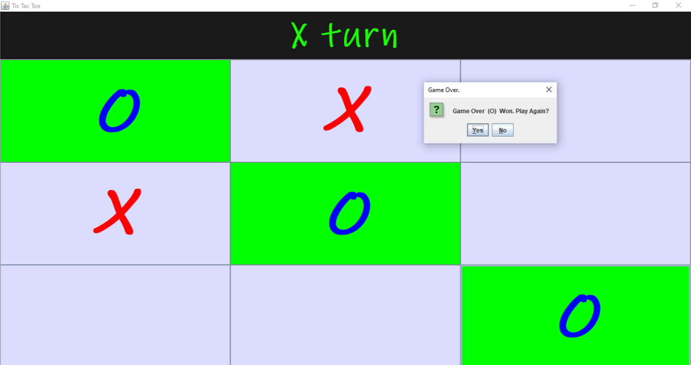
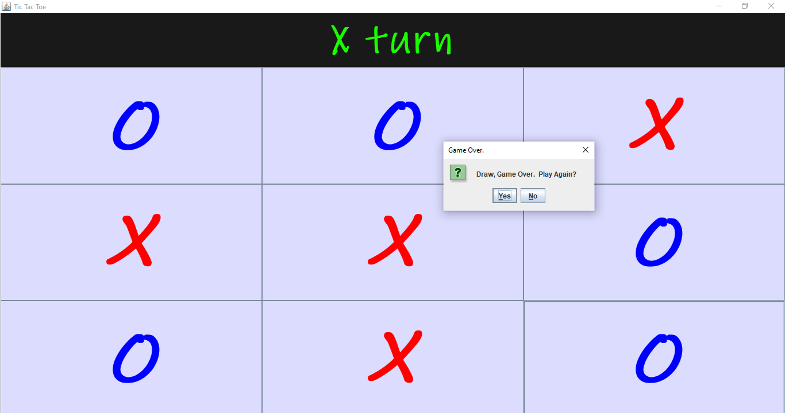

# tictactoe
Java swing game

 

## A simple game that requires two players. 

### Developed with NetBeans IDE,reminds a player that it's their turn to play. 
### After a win or draw a player can choose to play another game or quit. 
